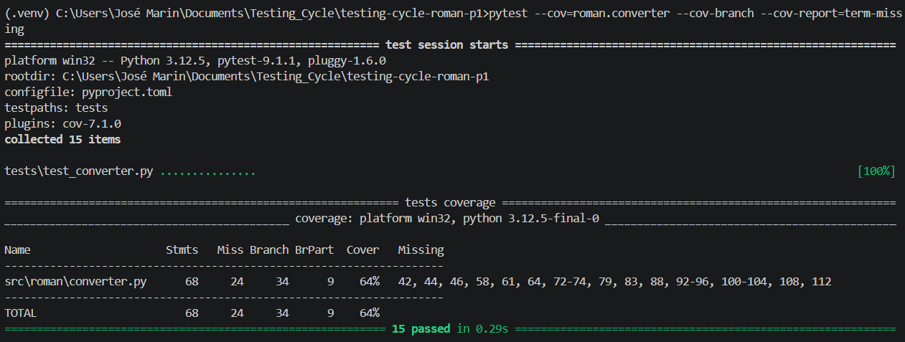
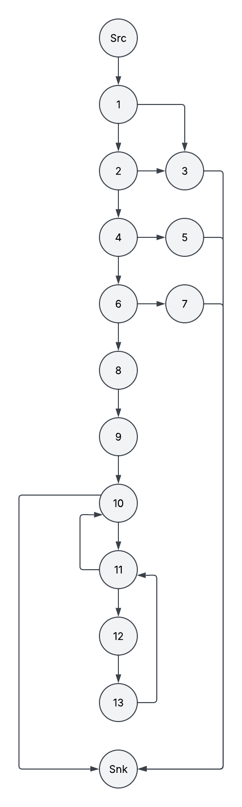
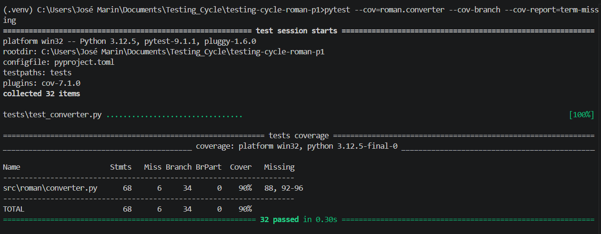
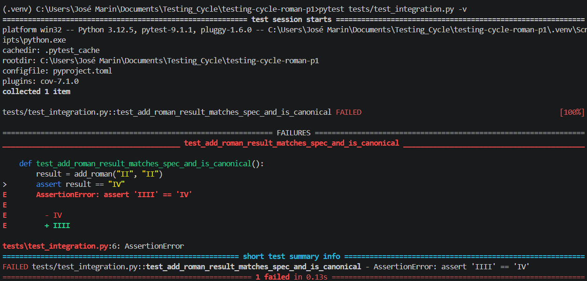
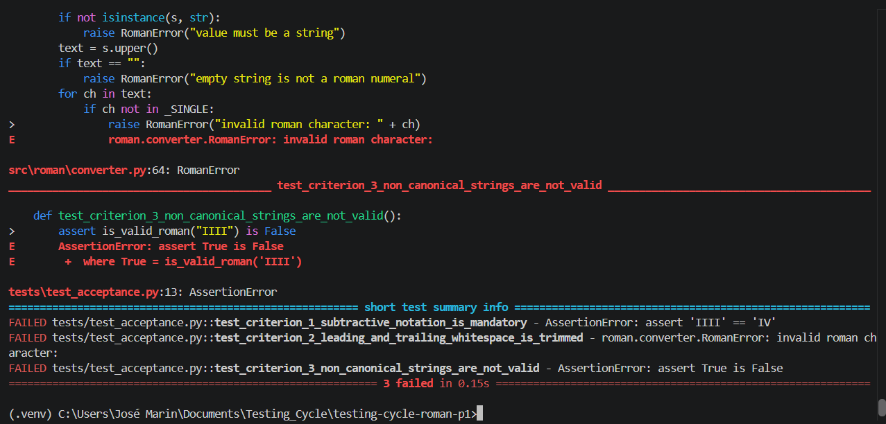

# Testing Life Cycle Workshop — Report

## Baseline
 
The inherited suite (`tests/test_converter.py`, 15 tests) was run unmodified before any change:
 
```
$ pytest
15 passed
```
 
Initial branch coverage of `src/roman/converter.py`:


 
---

### 9. Control flow graph of `to_roman` (lines 40–53)



#### Nodes

| Node | Statement(s) | Kind |
|---|---|---|
| N1 | `isinstance(n, int)` | decision D1 |
| N2 | `isinstance(n, bool)` | decision D2 |
| N3 | `raise RomanError("...integer")` (42) | raise |
| N4 | `n < _MIN_VALUE` (43) | decision D3 |
| N5 | `raise RomanError("...>= 1")` (44) | raise |
| N6 | `n > _MAX_VALUE` (45) | decision D4 |
| N7 | `raise RomanError("...<= 3999")` (46) | raise |
| N8 | `out = []; remaining = n` (47–48) | sequential |
| N9 | `for value, symbol in _PAIRS` (49) | decision D5 (loop test) |
| N10 | `while remaining >= value` (50) | decision D6 (loop test) |
| N11 | `out.append(symbol); remaining -= value` (51–52) | sequential (loop body) |
| N12 | `return "".join(out)` (53) | return |
| N13 | Exit | merge of all raises + return |

### 10. Cyclomatic complexity
 
Counting nodes and edges directly:
 
- **N (nodes) = 13**
- **E (edges) = 18**
**V(G) = E − N + 2 = 18 − 13 + 2 = 7**
 
### 11. Basis set of 7 linearly independent paths
 
Baseline method: start from one complete path, then flip one decision at a time.

| Path | Node sequence | Concrete input |
|---|---|---|
| P0 (baseline) | Src→1(F)→2(F)→4(F)→6(F)→8→9→10→[11(F)→10]×12→11(T)→12→13→11(F)→10→Snk | `n = 1` |
| P1 | Src→1(T)→3→Snk | `n = "4"` |
| P2 | Src→1(F)→2(T)→3→Snk | `n = True` |
| P3 | Src→1(F)→2(F)→4(T)→5→Snk | `n = 0` |
| P4 | Src→1(F)→2(F)→4(F)→6(T)→7→Snk | `n = 4000` |
| P5 | Src→1(F)→2(F)→4(F)→6(F)→8→9→10→11(T)→12→13→11(T)→12→13→11(F)→10→Snk | `n = 2` |
| P6 | Src→1(F)→2(F)→4(F)→6(F)→8→9→10→[11(F)→10]×11→11(F: pair "V")→10→11(T: pair "IV")→12→13→11(F)→10→Snk | `n = 4` |

 
### 12. Definition-Use table
 
Variables: `n` (parameter), `out`, `remaining`, `value`, `symbol` (the last two are bound by the `for`
at node 10). `d` = definition, `c` = computational use, `p` = predicate use.
 
| Variable | Def node | Use node | Use kind | Note |
|---|---|---|---|---|
| `n` | Src (parameter) | 1 | p | `isinstance(n, int)` |
| `n` | Src | 2 | p-use | `isinstance(n, bool)` |
| `n` | Src | 4 | p-use | `n < _MIN_VALUE` |
| `n` | Src | 6 | p-use | `n > _MAX_VALUE` |
| `n` | Src | 9 | c-use | `remaining = n` |
| `remaining` | 9 | 11 | p-use | first while test for a pair |
| `remaining` | 9 | 13 | c-use | `remaining -= value`, before any redefinition |
| `remaining` | **13** | 11 | p-use | **loop-carried**: redefinition inside the loop feeds the next while test |
| `remaining` | **13** | 13 | c-use | **loop-carried**: redefinition inside the loop feeds the next `-= value` |
| `value` | 10 | 11 | p-use | `remaining >= value` |
| `value` | 10 | 13 | c-use | `remaining -= value` |
| `symbol` | 10 | 12 | c-use | `out.append(symbol)` |
| `out` | 8 | 12 | c-use | `.append` reads the current list |
| `out` | **12** | 12 | c-use | **loop-carried**: each append reads the list left by the previous append |
| `out` | 8 or 12 | Snk | c-use | `"".join(out)` |

---

### 13. Unit tests and branch coverage

Tests added to `tests/test_converter.py`, after the 15 inherited tests, targeting the branches
`pytest --cov` reported as missing in section 0 (lines 42, 44, 46, 58, 61, 64, 72–74, 79, 83, 88,
92–96, 100–104, 108, 112)



## PART 4 - Integration finding

add_roman and subtract_roman are built on from_roman and to_roman. Implemented in tests/test_integration.py:



##  PART 5 - Acceptance criteria

Implemented in tests/test_acceptance.py:

| # | Given / When / Then | Spec section |
|---|---|---|
| 1 | Given the integer 4, when converted with `to_roman`, then the result is `"IV"`, never `"IIII"` | 2 |
| 2 | Given `"  IV  "` (leading/trailing whitespace), when parsed with `from_roman`, then the ends are trimmed and `4` is returned | 3 |
| 3 | Given the non-canonical string `"IIII"`, when checked with `is_valid_roman`, then the result is `False` | 4 |



## PART 6 - Fixing the defects


